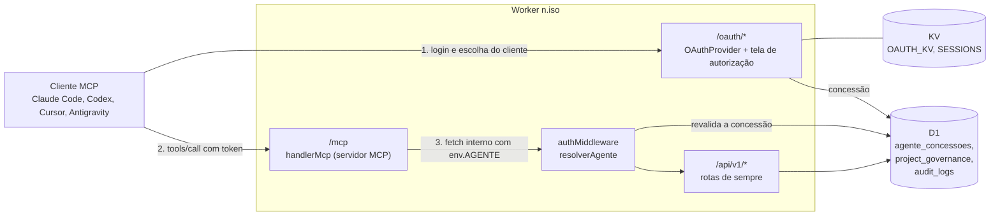
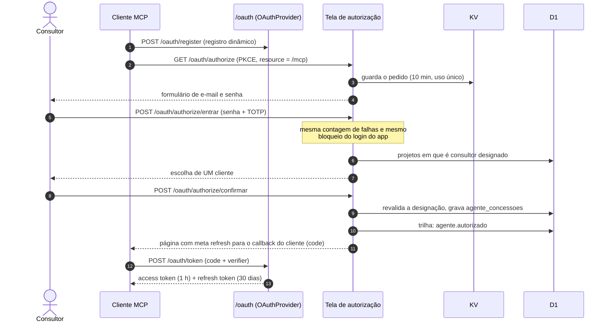
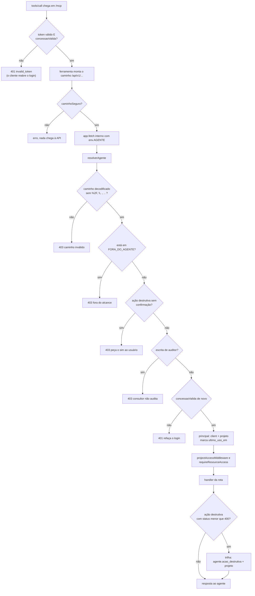
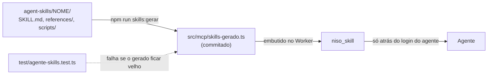

# Arquitetura do agente consultor

Como as peças se encaixam: o que existe, em qual arquivo, e o caminho exato de
uma conexão e de uma chamada. Para o que o agente faz e como usar, veja
[`README.md`](README.md). Para o que não pode quebrar, veja
[`seguranca.md`](seguranca.md).

---

## Visão geral

O agente **não tem uma API própria**. O Worker do n.iso ganhou três portas novas
e um principal novo; as rotas `/api/v1/*` são as mesmas de sempre.

Três decisões sustentam o desenho:

1. **Chamada interna, sem rede.** O `/mcp` chama `app.fetch` do próprio Worker.
   A identidade do agente viaja em `env.AGENTE`, numa **cópia** do ambiente;
   nenhum cabeçalho, token ou parâmetro a carrega. De fora, ninguém a forja.
2. **O principal herda o isolamento que já existe.** O agente entra como
   `role: 'client'` com `client_project_id`. Todo o controle de tenant do
   produto passa a valer para ele sem código novo.
3. **A concessão é revalidada a cada chamada.** O token OAuth sozinho não
   basta: a linha em `agente_concessoes` e a designação na governança são
   conferidas em toda requisição.

---

## Como uma conexão nasce

Detalhes que não são óbvios:

- A tela de autorização é nossa (`src/routes/oauth-autorizacao.ts`); o resto do
  OAuth (registro, token, metadados) é da biblioteca
  `@cloudflare/workers-oauth-provider`. Quem decide o que vai para quem é
  `ROTAS_OAUTH` em `src/index.ts`, **sobre o caminho decodificado**.
- O pedido fica no KV `SESSIONS` com a chave `oauth_pedido:<token>` e TTL de
  600 s. Falha de senha **consome** o pedido.
- A página final usa `meta refresh` e não `302`, porque o CSP
  `form-action 'self'` barra o redirecionamento pós-formulário para o callback
  local do cliente MCP.
- O grant só é concedido **depois** de `completeAuthorization`; falha ali não
  deixa concessão órfã.
- Conta com senha provisória não conecta agente.

---

## Como uma chamada é decidida

`concessaoValida` checa, numa só função (`src/middleware/agente.ts`): concessão
não revogada e não expirada, usuário ativo, papel `consultor`, e a pessoa
**ainda** designada como consultor na governança do projeto. Tirar alguém da
governança derruba o agente dela na chamada seguinte, sem esperar o token expirar.

---

## Mapa de arquivos

| Arquivo | Responsabilidade |
|---|---|
| `src/index.ts` | Monta o `OAuthProvider`, decide `ROTAS_OAUTH` × resto, publica `/mcp` e os metadados `/.well-known/oauth-*`. |
| `src/routes/oauth-autorizacao.ts` | A tela de autorização em três passos e a gravação da concessão. |
| `src/mcp/servidor.ts` | O servidor MCP: `handlerMcp`, `requisicaoInterna`, `caminhoSeguro`, as ferramentas do servidor remoto (`niso_contexto`, `niso_skill`, `niso_ler`, `niso_executar`). |
| `src/mcp/contexto.ts` | O que o agente lê ao começar: `INSTRUCOES` (até 2048 caracteres), `MAPA_DA_APP`, `ROTEIROS`, `montarContexto`. |
| `src/mcp/skills-gerado.ts` | As skills embutidas no Worker. **Gerado**: não edite à mão. |
| `src/middleware/agente.ts` | `concessaoValida`, `resolverAgente`, `FORA_DO_AGENTE`, `acaoDestrutiva`, `NOME_CLIENTE_SQL`. |
| `src/middleware/auth.ts` | Ramo `env.AGENTE` do `authMiddleware` e a trilha `agente.acao_destrutiva`. |
| `src/routes/agentes.ts` | O que o cliente vê e faz: listar e revogar os agentes do projeto. |
| `mcp-server-niso/src/ferramentas.ts` | As 24 ferramentas tipadas, o filtro por papel e o despacho. **Compartilhado** entre o servidor local (stdio) e o remoto. |
| `agent-skills/` | A fonte das skills (SKILL.md, referências, scripts). |
| `scripts/gerar-skills.mjs` | Escreve `src/mcp/skills-gerado.ts` a partir de `agent-skills/` (`npm run skills:gerar`). |
| `migrations/0034_agente_concessoes.sql` | A tabela das concessões. |
| `frontend/src/views/monitor.js` | O cartão "Agentes com acesso" na Governança. |
| `frontend/src/views/conectar-agente.js` | A tela "Conectar agente". |

---

## Dados

`agente_concessoes` é o que o token OAuth aponta e o que o cliente vê e revoga.

| Coluna | Para quê |
|---|---|
| `id` | O `concessaoId` que o token carrega. |
| `user_id` | O consultor. `ON DELETE CASCADE`. |
| `project_id` | O projeto. Um cliente com dois projetos tem **duas** concessões. `ON DELETE CASCADE`. |
| `cliente_mcp` | Nome do cliente MCP e destino do callback, para o cliente reconhecer o acesso. |
| `criado_em`, `expira_em` | Início e fim (30 dias depois do início). |
| `ultimo_uso_em` | Atualizado em toda chamada **aceita**. É o único sinal de leitura: a trilha só registra escrita. |
| `revogado_em`, `revogado_por` | Preenchidos ao revogar (pelo cliente, ou por troca de senha). |

A designação **não** tem tabela própria: é a linha de `project_governance` com
`role_category = 'consultor'`. É por isso que editar essa linha é protegido
(só `platform_admin` e o administrador do cliente designam consultor).

## Prazos e limites

| O quê | Valor | Onde |
|---|---|---|
| Pedido de autorização | 600 s, uso único | `TTL_PEDIDO` |
| Access token | 3600 s | `accessTokenTTL` |
| Refresh token | 30 dias | `refreshTokenTTL` |
| Concessão | 30 dias | `TTL_CONCESSAO_DIAS` |
| Falhas de login até o bloqueio | 5, por 15 min | `FALHAS_ATE_BLOQUEIO`, `BLOQUEIO_SEG` |
| Resposta de `niso_ler` e `niso_executar` | cortada em 100.000 caracteres | `LIMITE_TEXTO` |
| `INSTRUCOES` do handshake | até 2048 caracteres (limite do Claude Code) | `src/mcp/contexto.ts` |

---

## As ferramentas

O agente enxerga **25**: 4 do servidor remoto e 21 tipadas.

| Origem | Quais |
|---|---|
| Só do servidor remoto (`servidor.ts`) | `niso_contexto`, `niso_skill`, `niso_ler`, `niso_executar` |
| Tipadas (`ferramentas.ts`) | Leitura: `list_projects`, `get_project`, `list_controls`, `list_risks`, `gap_analysis`, `traceability`, `list_evidence`, `audit_pack`, `coherence_check`. Escrita: `create_risk`, `update_risk`, `generate_policy`, `generate_soa`, `evaluate_evidence`, `create_evidence`, `import_training`, `create_asset`, `update_policy`, `update_control`, `migrate_27701`, `respond_auditor_note` |

O servidor local define as 24 tipadas. O remoto esconde 3: as duas de escrita de
auditor (`create_audit_finding`, `create_auditor_note`) pelo papel, e
`generate_policies_bulk` por `BLOQUEADAS`. As tipadas são ergonomia: guiam o
modelo nos casos comuns. **A fronteira de segurança é o worker**, não a lista:
`niso_ler` e `niso_executar` alcançam qualquer rota que o consultor alcança, e é
a autorização do principal que decide.

---

## Skills

O Worker não lê disco, então o texto vai para dentro do bundle. O gerador
normaliza para LF: no Windows o checkout vem em CRLF e no CI em LF, e o módulo
gerado não pode depender disso.

---

## Como estender

**Skill nova.** Crie `agent-skills/<nome>/SKILL.md` com cabeçalho `name:` (igual à
pasta) e `description:`. Rode `npm run skills:gerar` e commite o resultado. Se for
um roteiro de trabalho, acrescente-o em `ROTEIROS` (`src/mcp/contexto.ts`).

**Ferramenta tipada nova.** Defina em `mcp-server-niso/src/ferramentas.ts`, com o
`case` no despacho. Se for escrita, entra no conjunto do consultor ou do auditor.
O `test/contrato-mcp.test.ts` fixa a contagem; atualize-a.

**Ferramenta nova só do servidor remoto.** Defina em `src/mcp/servidor.ts`, no
mesmo estilo de `niso_skill`. Se chamar a API, passe por `requisicaoInterna`.

**Rota nova.** Siga o checklist de [`seguranca.md`](seguranca.md#antes-de-abrir-um-pr-que-toque-a-superfície-do-agente).
O agente a alcança sozinho; a pergunta é se **deve**.

**Mudou o alcance do agente.** Atualize, no mesmo PR, o texto da tela de
consentimento (`oauth-autorizacao.ts`), `INSTRUCOES` / `ROTEIROS` /
`MAPA_DA_APP` e a lista de "fora do alcance" em `seguranca.md`.
